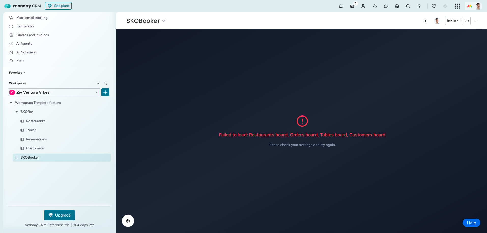
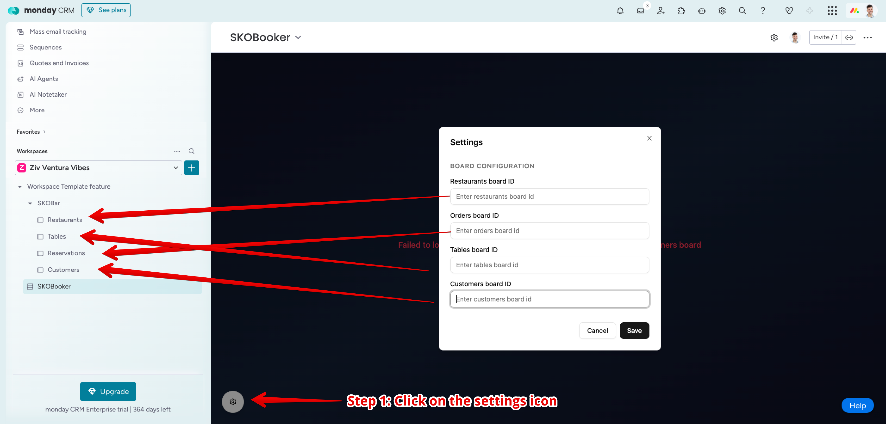
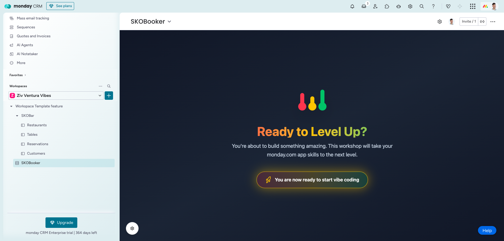
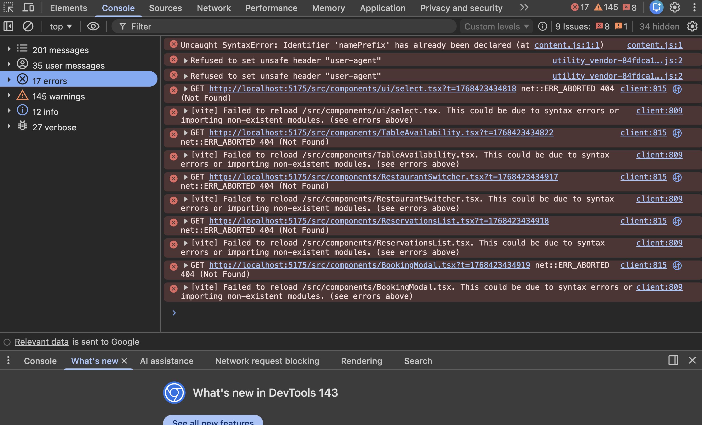

# monday.com App Workshop

Welcome! This guide will help you set up everything you need for the workshop. Don't worry if you're not a developer — just follow these steps one by one.

---

## Prerequisites

Before starting, you'll need to install three tools on your computer: **Node.js**, **Git**, and **Gemini CLI**.

### 1. Install Node.js

Node.js is a tool that allows you to run JavaScript applications on your computer.

1. Go to the official Node.js website: **https://nodejs.org**
2. Download the **LTS** version (the one on the left with the green button)
3. Open the downloaded file and follow the installation wizard
4. Click "Next" through all the steps and finish the installation

**To verify it's installed correctly:**
- Open your terminal (on Mac: search for "Terminal" in Spotlight, on Windows: search for "Command Prompt" or "PowerShell")
- Type `node --version` and press Enter
- You should see a version number like `v20.x.x` or similar

---

### 2. Install Git

Git is a tool that helps track changes to your code and collaborate with others.

1. Go to the official Git website: **https://git-scm.com/downloads**
2. Choose your operating system (Windows, Mac, or Linux)
3. Download and run the installer
4. Follow the installation wizard with the default options (just keep clicking "Next")

**To verify it's installed correctly:**
- Open your terminal
- Type `git --version` and press Enter
- You should see a version number like `git version 2.x.x`

---

### 3. Install Gemini CLI

Gemini CLI is an AI-powered terminal tool that we'll use during the workshop to build, debug, and deploy code.

1. Go to: **https://geminicli.com/**
2. Open your terminal and run:
```bash
npm install -g @google/gemini-cli
```
3. After installation, run `gemini` in your terminal to start the setup
4. Follow the prompts to authenticate with your Google account
5. Congratulations! You are all set with gemini!
---

## Getting Started

Once you have all prerequisites installed, follow these steps:

### 1. Clone the repository

1. Open your terminal
2. Navigate to where you want to save the project (e.g., `cd ~/Documents`)
3. Run the following command:
```bash
git clone https://github.com/mondaySE/sko-app-template.git
```
4. Enter the project folder:
```bash
cd sko-app-template
```
5. Start Gemini CLI with the Gemini 2.5 Pro model:
```bash
gemini --model gemini-2.5-pro
```

From this point on, you can ask Gemini CLI to help you with the remaining steps!

### 2. Install dependencies

In the project folder, run:
```bash
npm install
```

### 3. Start the development server

```bash
npm run dev
```

You should see a message with a local URL (usually `http://localhost:5175`). Open this URL in your browser to see the app!

### 4. Set up monday.com workspace

1. Go to your any monday.com account *MAKE SURE YOU HAVE ADMIN PERMISSIONS*: 
2. Install the SKOBar app using this link: **https://auth.monday.com/oauth2/authorize?client_id=d150460241dceb37a64999ac383fe762&response_type=install**
3. Go to Admin -> Apps -> SKOBar -> Click on app -> Click "Use app" -> Select workspace
4. Open your selected workspace, the SKOBar app and the boards will be there. Take your time to explore the boards in the workspace and understand how they work
5. Open the SKOBooker app in your workspace, it should look like this

6. Configure the board ids of each board respectively

7. Click "Save", page should reload and fetch the boards. After loading is done you should see this screen:

8. Congratulations! You're ready to start vibe coding!

---

## Building Your App

This project uses **Material UI (MUI)** as the design system. When creating new components, use MUI components for a consistent, professional look.

**Helpful resources:**
- MUI Documentation: **https://mui.com/material-ui/**
- MUI Component Gallery: **https://mui.com/material-ui/all-components/**

---

## Cheat Sheet: Useful Commands

During the workshop, you can use these simple commands by typing them in Gemini CLI:

| Command | What it does |
|---------|--------------|
| `save` | Saves your current work as a checkpoint. You'll be asked to give it a name. |
| `reset` | Discards all your changes and goes back to your last saved checkpoint. |
| `checkpoints` | Shows a list of all your saved checkpoints. |
| `rollback` | Goes back to the previous checkpoint. |
| `rollback <id>` | Goes back to a specific checkpoint (use the ID from `checkpoints`). |

**Tips:**
- Use `save` frequently to create checkpoints before trying something new
- Use `reset` if you want to start over from your last save
- Use `rollback` if your last save introduced a mistake

---

## Troubleshooting

### App won't render?

If your app isn't loading or showing a blank screen, you can check for errors using Chrome's Developer Tools:

**Opening Developer Tools:**
1. Open Google Chrome and navigate to your monday app
2. Right-click anywhere on the page and select **"Inspect"**
   - Or use the keyboard shortcut: `Cmd + Option + I` (Mac) or `Ctrl + Shift + I` (Windows)
3. Click on the **"Console"** tab at the top of the Developer Tools panel

**Copying errors from the Console:**
1. Look for any red error messages in the Console
2. Click on an error message to expand it (if needed)
3. Right-click on the error message and select **"Copy" > "Copy message"**
   - Or select the error text and press `Cmd + C` (Mac) or `Ctrl + C` (Windows)
4. Paste the copied error into Gemini CLI for help



**Pro tip:** If there are multiple errors, you can right-click in the Console and select **"Save as..."** to download the entire console log as a text file.

---

### EACCES permission denied error?

If you see an error like `EACCES: permission denied` when running `npm install -g`, it means npm doesn't have permission to write to the global packages folder.

**Quick fix (recommended):**

Run the install command with `sudo` (you'll be prompted for your password):
```bash
sudo npm install -g @google/gemini-cli
```

**Permanent fix (Mac/Linux):**

Change ownership of npm's directories so you won't need `sudo` for future global installs:
```bash
sudo chown -R $(whoami) $(npm config get prefix)/{lib/node_modules,bin,share}
```

Then try installing again without `sudo`:
```bash
npm install -g @google/gemini-cli
```

---

## Need Help?

If you run into any issues:
1. Make sure you've installed Node.js, Git, and Gemini CLI
2. Try closing and reopening your terminal
3. Ask your instructor for assistance

---

Happy coding! 🚀
